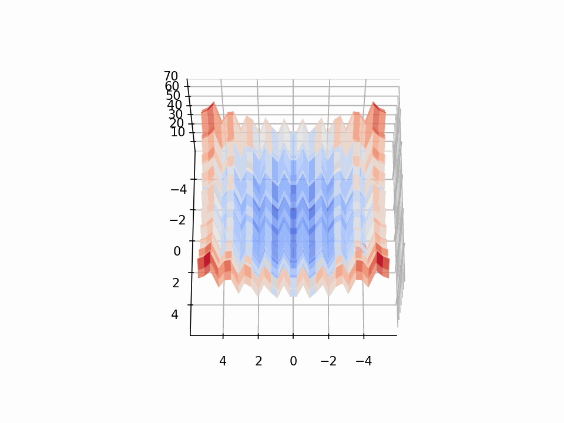
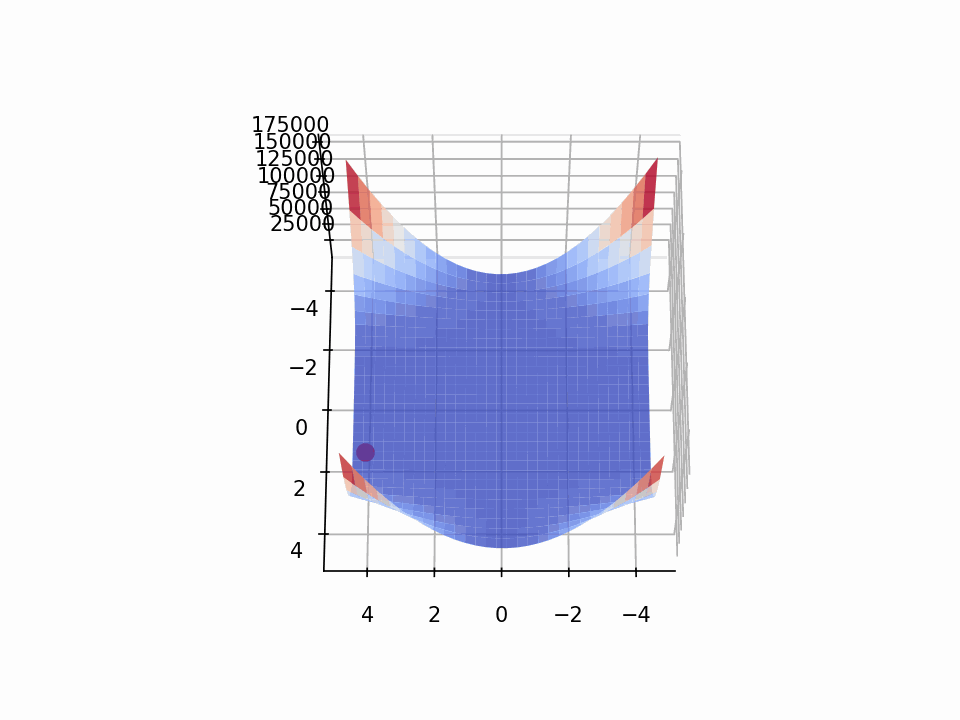

# Artishow Project :

## Nature-inspired optimization for predicting molecular structure

Lennard-Jones Problems
#
## Repository Structure :

- *RandomSearch* folder: contains the work on random search.

- *SimulatedAnnealing* folder: contains each student's implementation of simulated annealing. *A final version can be found in the SA_Thomas\Version_organisée folder.*

- *IllustrationsReadme* folder: contains assets used to illustrate this README.
    

## Results Presentation :

#### Random Search

 

*Example of a random search performed on a function with numerous local minima.*

###### Note
    This method yields results of highly variable quality and is extremely time-consuming if a coherent result is desired (requiring a minimum of 1 million samples).

#### Simulated Annealing

This method draws inspiration from thermodynamic processes used in pottery firing, from which it also derives its name. 

Most importantly, it enables the algorithm to escape local minima and guarantees convergence toward a global minimum.

##### Illustration 1

##### Illustration 2

###### Note :

    The energy diagrams clearly show that this method successfully escapes energy wells to discover lower-energy states.
